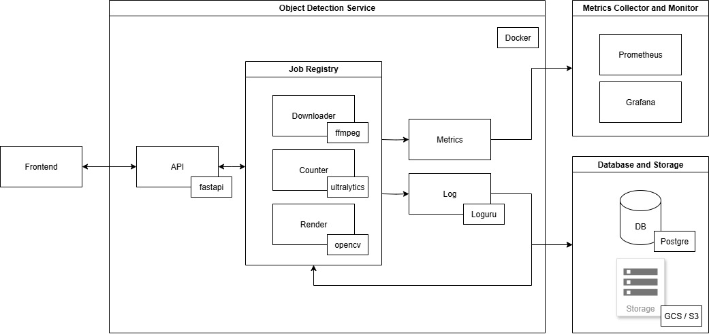
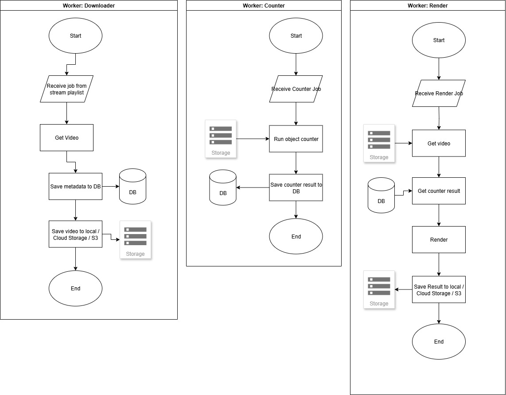

# OpenPeopleCounterCV
Computer vision project, counting people or objects in COCO dataset in polygon areas from video stream

- [x] Desain Database
    - data objek atau orang yg terdeteksi
    - data counting
    - data konfigurasi area
    - bagaimana desain sistem dari awal sampai akhir
    - bagaimana relasi antara tabel dan konfigurasi area polygon
- [x] Pengumpulan Dataset
- [x] Object Detection & Tracking
- [x] Counting & Polygon Area
- [x] Prediksi
- [ ] Integrasi API
    - get /api/stats: history dan filter range waktu dan pagination
    - get /api/stats/live: menampilkan jumlah orang yg masuk/keluar
    - post api/config/area
    - get /api//videos/player?detection_id=xxx: untuk menampilkan hasil render dari deteksi
- [ ] Deployment
    - docker compose
    - gimana cara menjalankan sistem

# How to Use Notebook
Run from number 1 > 2 > 3

The result will be in output folder

# Database Design

# System Design
## Architechture

## Component

Sistem ini terdiri dari 3 bagian:
1. Downloader
2. Counter
3. Render

## Downloader
Kendala video stream (dalam kasus ini video stream cctv) adalah di akses videonya, dimana kita tidak bisa melakukan rewind ke waktu yg sudah terjadi.

Jika kita tidak menyimpan videonya dulu sebelum melakukan deteksi/menghitung/analisa maka takutnya ada kesalahan di suatu hal yg nantinya menghambat deteksi ulang karena kita tidak menyimpan videonya. 

Dengan menyimpan video juga kita bisa bebas melakukan berbagai macam analisa atau deteksi yg diperlukan.

Maka dari itu modul ini digunakan untuk mendownload video stream, misal dari cctv publik.

Untuk mendownloadnya kita perlu mengetahui platlistnya yg memiliki ekstensi .m3u8

Untuk cara manualnya:
1. Kita bisa get playlist.m3u8, didalamnya akan ada informasi tentang video dan chunk list, misal chunklist_w1565071281.m3u8
2. Get chunk list tersebut, maka akan ada list video chunknya, misal media_w1383434385_955.ts
3. Get file tersebut

Untuk cara praktisnya:
1. Kita hanya perlu menggunakan ffmpeg, input playlist, dimana tempat menyimpannya, durasi, dan informasi lainnya.

Modul ini akan menyimpan video di local storage, jika tidak di lokal maka bisa menyimpannya di Cloud Storage, S3 dan metadata akan tersimpan di local json atau database.

Yg baru implementasi adalah save video dan metadata di local.

## Counter

Sistem counter ini menggunakan YOLO11, versi YOLO terbaru sangat direkomendasikan karena performanya yg lebih tinggi dari pendahulunya dan juga digunakan agar tetap update dengan perkembangannya, YOLO sangat mudah untuk diimplementasikan menggunakan Ultralytics meskipun lisensinya harus menggunakan AGPL, namun untuk komersial bisa membayar lisensinya. YOLO ini terkenal sangat cepat saat melakukan deteksi walaupun menggunakan CPU, apalagi jika modelnya diconvert terlebih dahulu ke format ONNX, kecepatan deteksinya akan semakin lebih kencang.

Trackingnya sendiri bisa menggunakan botsort atau bytrack custom yg bisa disesuaikan dengan kebutuhan kita, jika memilih akurasi maka botsort dan jika memilih kecepatan maka pilih bytetrack.

Untuk region untuk melakukan counting bisa ditambahkan beberapa region, tidak hanya satu region saja, dan bisa diubah sesuaikan.

Bagaimana counter ini bekerja:
1. Objek dideteksi menggunakan YOLO
2. Objek ditracking menggunakan metode tracking yg dipilih
3. Setiap framenya:
    1. Ambil semua bbox setiap objek yg ditracking, lalu hitung koordinat tengah bbox nya.
    2. Bandingkan dengan setiap regionnya, apakah didalam atau diluar.
    3. Jika didalam maka hitung dan beri penanda bahwa objek tersebut masuk ke region.

## Render
Modul ini digunakan untuk merender hasil deteksi ke video originalnya.
