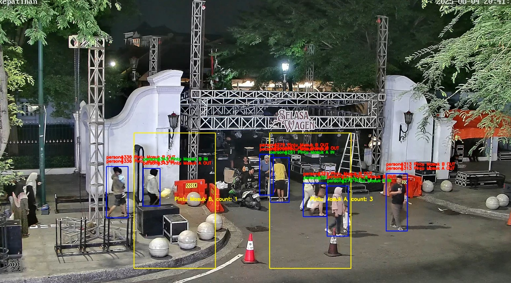

# OpenPeopleCounterCV

Computer vision project, counting people or objects (COCO datasets) in polygon areas from video stream

- [x] Desain Database
    - Data objek atau orang yg terdeteksi
    - Data counting
    - Data konfigurasi area
    - Bagaimana desain sistem dari awal sampai akhir
    - Bagaimana relasi antara tabel dan konfigurasi area polygon
- [x] Pengumpulan Dataset
- [x] Object Detection & Tracking
- [x] Counting & Polygon Area
- [x] Prediksi
- [x] Integrasi API
    - GET /api/stats (diganti ke GET /api/detection/..): history dan filter range waktu dan pagination
    - GET /api/stats/live (diganti ke GET /api/videos/player ): menampilkan jumlah orang yg masuk/keluar
    - POST api/config/area (diganti ke POST /api/regions/)
    - GET /api/videos/player?detection_id=xxx: untuk menampilkan hasil render dari deteksi
- [x] Deployment
    - Note: tidak cukup waktu untuk buat docker compose
    - local setup
    - gimana cara menjalankan sistem

# How to run
1. Create python (3.12) venv and install all requirements.txt and create .env file
```
DATABASE_PROVIDER=POSTGRES
POSTGRES_DSN=dbname=testing user=postgres password=postgres host=localhost port=5432
```
2. Run `uvicorn src.main:app`
3. Download the stream video `POST /api/videos/download`
    - Sudah ada contoh bodynya di /docs atau /redoc
4. Create region (area) `POST /api/regions/`
    - Sudah ada contoh bodynya di /docs atau /redoc
5. Detect `POST /api/detection/`
    - Sudah ada contoh bodynya di /docs atau /redoc
    - List video_id `GET /api/videos`
    - List region `GET /api/regions`
6. Render detection result `POST /api/render/{detection_id}`
    - List detection id `GET /api/detection/detection_jobs`
7. View rendered video `GET /api/videos/player?detection_id={detection_id}`
    - List detection id `GET /api/detection/detection_jobs`

# APIs
## Videos

- `POST /api/videos/download`  
  Download Video Stream

- `GET /api/videos/`  
  List Downloaded Videos

- `DELETE /api/videos/{video_id}`  
  Delete Downloaded Video

- `GET /api/videos/player`  
  Play Video from render result

---

## Regions (Area)

- `GET /api/regions/`  
  List Regions

- `POST /api/regions/`  
  Create Region

- `GET /api/regions/{region_id}`  
  Get Region

- `PUT /api/regions/{region_id}`  
  Update Region

- `DELETE /api/regions/{region_id}`  
  Delete Region

---

## Detection

- `POST /api/detection/`  
  Run detection job on downloaded video

- `GET /api/detection/detection_jobs`  
  Get Detection Jobs

- `GET /api/detection/detection_events`  
  Get Detection Events

- `GET /api/detection/detection_objects`  
  Get Detection Objects

---

## Render

- `POST /api/render/{detection_id}`  
  Render Video from detection job

- `GET /api/render/render_registry`  
  List Render Registry

---

## Health

- `GET /health`  
  Health Check


# How to Use Notebook
Untuk menjalankan versi notebook jalankan dari nomor 1 > 2 > 3 (mungkin bisa beda dengan yg di API krn hanya test sekilas dan bugfix di versi API)

# Database Design


- region_registry: Digunakan untuk menyimpan area polygon yg akan dilakukan counting, polygon bisa direuse di banyak video.
- detect_region_mapping: Untuk mapping relasi many to many ke tugas detection
- system_log: Digunakan untuk menyimpan log di sistem
- video_registry: Digunakan untuk menyimpan informasi video yg didownload dari stream
- detection_jobs: Menyimpan informasi dan konfigurasi tentang tugas deteksi
- detection_event: Setiap detection job akan memiliki banyak detection event, detection event ini dihitung per satu frame, tabel ini berisi informasi yg berkaitan dengan deteksi di suatu region yg ada di region registry juga hasil count nya.
- detection_objects: Setiap event memiliki banyak objek yg dideteksi, tabel ini menyimpan semua informasi tentang objek yg dideteksi, termasuk apakah objek ini didalam region atau tidak.
- render_registry: Menyimpan informasi list video hasil render dari tugas deteksi.

# System Design
## Architechture


## Component
Sistem ini terdiri dari 3 bagian utama:
1. Downloader
2. Counter
3. Render

## Downloader
Kendala video stream (dalam kasus ini video stream cctv) adalah di akses videonya, dimana kita tidak bisa melakukan rewind ke waktu yg sudah lampau.

Jika kita tidak menyimpan videonya dulu sebelum melakukan deteksi/menghitung/analisa maka takutnya ada kesalahan di suatu hal yg nantinya menghambat deteksi ulang karena kita tidak menyimpan videonya. 

Dengan menyimpan video juga kita bisa bebas melakukan berbagai macam analisa atau deteksi yg diperlukan.

Maka dari itu modul ini digunakan untuk mendownload video stream, misal dari cctv publik.

Untuk mendownloadnya kita perlu mengetahui platlistnya yg memiliki ekstensi .m3u8

Untuk cara manualnya:
- Kunjungi web CCTV publik dan pilih video yg ingin diambil.
- Inspect Element dan lihat di bagian Network.
- Lihat ada aktivitas get playlist.m3u8, ambil url tersebut.
- Kita bisa get playlist.m3u8, didalamnya akan ada informasi tentang video dan chunk list, misal chunklist_w1565071281.m3u8.
- Get chunk list tersebut, maka akan ada list video chunknya, misal media_w1383434385_955.ts.
- Get file tersebut.

Untuk cara praktisnya:
1. Kita hanya perlu menggunakan ffmpeg, input playlist, dimana tempat menyimpannya, durasi, tipe output file dan informasi lainnya.
2. Selesai.

Modul ini akan menyimpan video di local storage, jika tidak di lokal maka bisa menyimpannya di Cloud Storage, S3 dan metadata akan tersimpan di local json atau database SQL/NoSQL.

Yg baru implementasi adalah save video di local dan metadata di local dan db.

## Counter
Sistem counter ini direkomendasikan menggunakan YOLO11, versi YOLO terbaru ini sangat direkomendasikan karena performanya yg lebih tinggi dari pendahulunya dan juga digunakan agar tetap update dengan perkembangannya, YOLO sangat mudah untuk diimplementasikan menggunakan Ultralytics meskipun lisensinya harus menggunakan AGPL, namun untuk komersial bisa membayar lisensinya. YOLO ini terkenal sangat cepat saat melakukan deteksi walaupun menggunakan CPU, apalagi jika modelnya diconvert terlebih dahulu ke format ONNX, kecepatan deteksinya akan semakin lebih kencang.

Trackingnya sendiri bisa menggunakan botsort atau bytrack custom yg bisa disesuaikan dengan kebutuhan kita, jika memilih akurasi maka pilih botsort dan jika memilih kecepatan maka pilih bytetrack.

Untuk region counting bisa ditambahkan beberapa region, tidak hanya satu region saja, dan bisa diubah sesuaikan.

Bagaimana counter ini bekerja:
1. Objek dideteksi menggunakan YOLO
2. Objek ditracking menggunakan metode tracking yg dipilih
3. Setiap framenya:
    1. Ambil semua bbox setiap objek yg ditracking, lalu hitung koordinat tengah bbox nya.
    2. Bandingkan dengan setiap regionnya, apakah didalam atau diluar.
    3. Jika didalam maka hitung dan beri penanda bahwa objek tersebut masuk ke region.

## Render
Modul ini digunakan untuk merender hasil deteksi ke video originalnya.

# Note
- Karena keterbatasan waktu, proyek ini tidak di test secara keseluruhan, mungkin bisa jadi ada bug karena test case yg tidak menyeluruh.
- Karena keterbatasan waktu juga, sistem ini masih kurang optimal, untuk kedepannya bisa ditambahkan:
    - Metrics dengan prometheus dan grafana untuk monitoring sistemnya.
    - Live detection (Download dan detection dalam satu waktu).
    - Optimasi saat insert ke database.
    - Optimasi model dengan versi ONNX.
    - Menambahkan dashboard atau frontend.
    - Generate documentation menggunakan sphinx.
    - Menggunakan docker.
    - dll.
